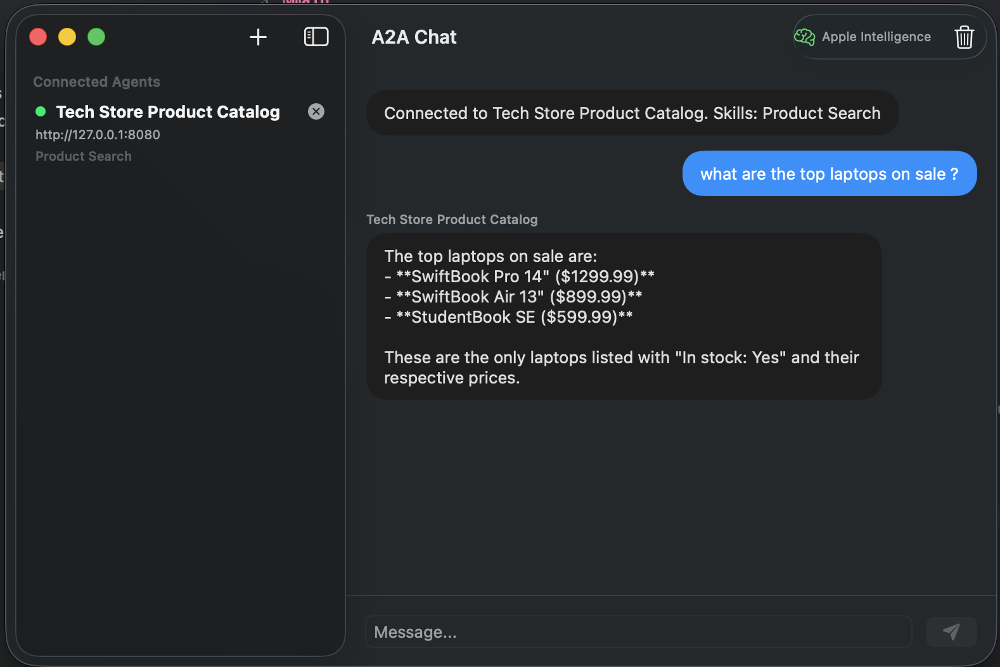

<p align="center">
  
  
  
  
</p>

# A2A for Swift

The **complete Swift SDK** for Google's [Agent-to-Agent (A2A) protocol](https://google.github.io/A2A/) — build, connect, and orchestrate AI agents that talk to each other.

Zero dependencies. Native Swift concurrency. Production-ready.

---

## Why A2A?

AI agents are everywhere — but they can't talk to each other. Google's **A2A protocol** fixes that by defining a standard way for agents to discover capabilities, exchange messages, stream results, and collaborate on tasks — regardless of framework, language, or vendor.

**a2a-swift** brings this to the Apple ecosystem and Swift on Linux, so your agents can interoperate with any A2A-compatible agent in Python, JavaScript, Java, .NET, or Go.

## Why this SDK?

- **Just implement `execute()`** — the SDK handles task lifecycle, event processing, SSE streaming, and push notifications automatically
- **Native Swift concurrency** — `async/await`, `AsyncSequence`, actors. No Combine, no callbacks
- **Zero dependencies** — pure Foundation. No framework lock-in
- **Framework-agnostic server** — plug into Vapor, Hummingbird, or any HTTP stack with a single router
- **Full protocol coverage** — every A2A v1.0 method, type, and error code

---

## Installation

Add to your `Package.swift`:

```swift
dependencies: [
    .package(url: "https://github.com/Victory-Apps/a2a-swift.git", from: "0.2.0")
]
```

Then add the dependency to your target:

```swift
.target(name: "MyApp", dependencies: ["A2A"])
```

## Quick Start

### Build an agent in ~30 lines

```swift
import A2A

// 1. Implement your agent logic
struct TranslationAgent: AgentExecutor {
    func execute(context: RequestContext, updater: TaskUpdater) async throws {
        updater.startWork(message: "Translating...")

        let translated = try await translate(context.userText)

        updater.addArtifact(
            name: "translation",
            parts: [.text(translated)]
        )
        updater.complete()
    }
}

// 2. Define your agent card
let card = AgentCard(
    name: "Translator",
    description: "Translates text between languages",
    supportedInterfaces: [
        AgentInterface(url: "https://my-agent.com", protocolVersion: "1.0")
    ],
    version: "1.0.0",
    capabilities: AgentCapabilities(streaming: true),
    defaultInputModes: ["text/plain"],
    defaultOutputModes: ["text/plain"],
    skills: [
        AgentSkill(
            id: "translate",
            name: "Translate",
            description: "Translates text between languages",
            tags: ["translation", "language"],
            examples: ["Translate 'hello' to French"]
        )
    ]
)

// 3. Create the handler and router — done!
let handler = DefaultRequestHandler(executor: TranslationAgent(), card: card)
let router = A2ARouter(handler: handler)
```

The `DefaultRequestHandler` automatically manages:
- Task creation and lifecycle
- Event processing and store updates
- SSE streaming for real-time responses
- Push notification delivery
- Error handling and JSON-RPC formatting

### Talk to any A2A agent

```swift
import A2A

let client = A2AClient(baseURL: URL(string: "https://agent.example.com")!)

// Discover what the agent can do
let card = try await client.fetchAgentCard()
print("Agent: \(card.name) — \(card.description)")
print("Skills: \(card.skills.map(\.name).joined(separator: ", "))")

// Send a message
let response = try await client.sendMessage(SendMessageRequest(
    message: Message(role: .user, parts: [.text("Translate 'hello' to French")])
))

// Stream responses in real-time
let stream = try await client.sendStreamingMessage(SendMessageRequest(
    message: Message(role: .user, parts: [.text("Write a detailed report")])
))

for try await event in stream {
    switch event {
    case .statusUpdate(let update):
        print("Status: \(update.status.state)")
    case .artifactUpdate(let update):
        print(update.artifact.parts.compactMap(\.text).joined())
    case .task(let task):
        print("Task \(task.id): \(task.status.state)")
    case .message(let message):
        print(message.parts.compactMap(\.text).joined())
    }
}
```

---

## Apple Intelligence Integration

Build A2A agents powered by Apple's on-device language model — zero cloud dependency, complete privacy:

```swift
#if canImport(FoundationModels)
import A2A
import FoundationModels

struct AppleIntelligenceAgent: AgentExecutor {
    func execute(context: RequestContext, updater: TaskUpdater) async throws {
        guard SystemLanguageModel.default.isAvailable else {
            updater.fail(message: "Apple Intelligence not available")
            return
        }

        let session = LanguageModelSession(instructions: "You are a helpful assistant.")
        updater.startWork(message: "Thinking...")

        let artifactId = UUID().uuidString
        let stream = session.streamResponse(to: context.userText)

        var lastContent = ""
        var isFirst = true
        for try await partial in stream {
            let delta = String(partial.content.dropFirst(lastContent.count))
            lastContent = partial.content
            guard !delta.isEmpty else { continue }

            updater.streamText(delta, artifactId: artifactId, append: !isFirst)
            isFirst = false
        }

        updater.streamText("", artifactId: artifactId, append: true, lastChunk: true)
        updater.complete()
    }
}
#endif
```

> Requires iOS 26+ / macOS 26+ with Apple Intelligence enabled. See [`Examples/OnDeviceLLMAgent.swift`](Examples/OnDeviceLLMAgent.swift) for the full example including structured output, and [`Examples/A2AClientApp.swift`](Examples/A2AClientApp.swift) for a SwiftUI chat client.

---

## Samples & Examples

### Sample Apps

Complete, runnable applications in [`Samples/`](Samples/):

<p align="center">
  
</p>

| Sample | Description | Stack |
|--------|-------------|-------|
| [**A2AServer**](Samples/A2AServer/) | Dockerized product catalog agent with Ollama LLM, streaming responses, and conversation memory | Vapor · Docker · Ollama |
| [**A2AChatClient**](Samples/A2AChatClient/) | macOS chat client with multi-agent connectivity, Apple Intelligence routing, and streaming UI | SwiftUI · Foundation Models |

```bash
# Start the server (requires Docker Desktop — or run locally with swift run)
cd Samples/A2AServer && docker compose up --build

# Open the client in Xcode (requires Xcode 26+)
cd Samples/A2AChatClient && open Package.swift
# Build & Run (⌘R), then connect to http://localhost:8080
```

### Code Examples

Single-file reference snippets in [`Examples/`](Examples/):

| File | What it shows |
|------|---------------|
| [EchoAgent.swift](Examples/EchoAgent.swift) | `AgentExecutor` patterns — echo, streaming, multi-turn |
| [A2AClientApp.swift](Examples/A2AClientApp.swift) | SwiftUI client with streaming & agent card discovery |
| [OnDeviceLLMAgent.swift](Examples/OnDeviceLLMAgent.swift) | Apple Intelligence on-device agent |

---

## Agent Patterns

### Streaming agent

Stream results token-by-token using `AsyncSequence`-based event delivery:

```swift
struct StreamingAgent: AgentExecutor {
    func execute(context: RequestContext, updater: TaskUpdater) async throws {
        updater.startWork()
        let artifactId = UUID().uuidString

        for chunk in generateChunks(context.userText) {
            updater.streamText(chunk, artifactId: artifactId, append: true)
        }
        updater.streamText("", artifactId: artifactId, append: true, lastChunk: true)
        updater.complete()
    }
}
```

### Multi-turn conversation

Keep the task alive with `requireInput()` to build interactive flows:

```swift
struct ChatAgent: AgentExecutor {
    func execute(context: RequestContext, updater: TaskUpdater) async throws {
        updater.startWork()

        if context.isNewTask {
            updater.addArtifact(parts: [.text("Hello! What would you like to discuss?")])
            updater.requireInput(message: "Waiting for your response...")
        } else {
            let reply = try await generateReply(context.userText)
            updater.addArtifact(parts: [.text(reply)])
            updater.requireInput(message: "Anything else?")
        }
    }
}
```

### Client with authentication

```swift
let client = A2AClient(
    baseURL: agentURL,
    interceptors: [
        BearerAuthInterceptor(token: "your-api-key")
    ]
)

// Or use a custom interceptor
struct MyAuthInterceptor: A2AClientInterceptor {
    func before(request: inout URLRequest, method: A2AMethod) async throws {
        let token = try await fetchToken()
        request.setValue("Bearer \(token)", forHTTPHeaderField: "Authorization")
    }
}
```

---

## HTTP Framework Integration

The `A2ARouter` is framework-agnostic. Here's how to plug it in:

### Vapor

```swift
import Vapor
import A2A

func routes(_ app: Application, router: A2ARouter) {
    app.get(".well-known", "agent-card.json") { req async throws -> Response in
        let data = try await router.handleAgentCardRequest()
        var headers = HTTPHeaders()
        headers.add(name: .contentType, value: "application/json")
        return Response(status: .ok, headers: headers, body: .init(data: data))
    }

    app.post { req async throws -> Response in
        let body = Data(buffer: req.body.data ?? ByteBuffer())
        let result = try await router.route(body: body)
        switch result {
        case .response(let data):
            var headers = HTTPHeaders()
            headers.add(name: .contentType, value: "application/json")
            return Response(status: .ok, headers: headers, body: .init(data: data))
        case .stream(let stream):
            // Return SSE stream
            var headers = HTTPHeaders()
            headers.add(name: .contentType, value: "text/event-stream")
            let responseBody = Response.Body(asyncStream: { writer in
                for try await chunk in stream {
                    try await writer.write(.buffer(.init(data: chunk)))
                }
            })
            return Response(status: .ok, headers: headers, body: responseBody)
        case .agentCard(let data):
            return Response(status: .ok, body: .init(data: data))
        }
    }
}
```

### Hummingbird

```swift
import Hummingbird
import A2A

let app = Application()
let router = A2ARouter(handler: DefaultRequestHandler(executor: MyAgent(), card: myCard))

app.router.get(".well-known/agent-card.json") { _, _ in
    let data = try await router.handleAgentCardRequest()
    return Response(status: .ok, headers: [.contentType: "application/json"], body: .init(byteBuffer: ByteBuffer(data: data)))
}

app.router.post("/") { request, _ in
    let body = try await request.body.collect(upTo: 1_048_576)
    let result = try await router.route(body: Data(buffer: body))
    // handle .response / .stream / .agentCard
}
```

---

## Architecture

```
Sources/A2A/
├── Models/
│   ├── JSONValue.swift             Type-safe arbitrary JSON
│   ├── Part.swift                  Content: text, binary, URL, structured data
│   ├── Message.swift               Messages with role (user/agent) and parts
│   ├── Artifact.swift              Task output artifacts
│   ├── Task.swift                  Task, TaskState, TaskStatus
│   ├── Events.swift                Stream events and response unions
│   ├── Requests.swift              All JSON-RPC request/response types
│   ├── AgentCard.swift             Agent discovery and capabilities
│   ├── Security.swift              API key, OAuth2, OpenID, mTLS schemes
│   ├── PushNotification.swift      Webhook push notification config
│   └── Errors.swift                A2A error codes (-32001 to -32009)
│
├── JSONRPC/
│   └── JSONRPCMessage.swift        JSON-RPC 2.0 request/response/error layer
│
├── Client/
│   ├── A2AClient.swift             Full client with SSE streaming
│   └── ClientInterceptor.swift     Middleware: BearerAuth, APIKey, custom
│
└── Server/
    ├── AgentExecutor.swift          ← You implement this
    ├── RequestContext.swift         Rich context + TaskUpdater helpers
    ├── EventQueue.swift             AsyncSequence pub/sub, multi-subscriber
    ├── TaskStore.swift              Protocol for custom storage backends
    ├── InMemoryTaskStore.swift      Actor-based reference implementation
    ├── TaskManager.swift            Event processing + store updates
    ├── PushNotificationSender.swift Webhook delivery
    ├── DefaultRequestHandler.swift  Orchestrates everything automatically
    └── A2AServer.swift              Low-level handler protocol + router
```

**Two ways to build agents:**

| Approach | Best for | You implement |
|----------|----------|---------------|
| `AgentExecutor` + `DefaultRequestHandler` | Most agents | Just `execute()` — SDK handles the rest |
| `A2AAgentHandler` + `A2ARouter` | Full control | All handler methods manually |

---

## Protocol Coverage

Full implementation of the [A2A v1.0 specification](https://google.github.io/A2A/specification/).

| Category | Features |
|----------|----------|
| **Core** | SendMessage, GetTask, ListTasks, CancelTask |
| **Streaming** | SendStreamingMessage (SSE), SubscribeToTask (SSE) |
| **Discovery** | Agent Card (`.well-known/agent-card.json`), Extended Agent Card |
| **Security** | API Key, HTTP Bearer, OAuth 2.0 (auth code, client credentials, device code), OpenID Connect, Mutual TLS |
| **Push** | Create/Get/List/Delete push notification configs, webhook delivery |
| **Transport** | JSON-RPC 2.0 over HTTP(S) |
| **Errors** | All 9 A2A error codes + standard JSON-RPC errors |

### Comparison with official SDKs

| Feature | Python | JS/TS | Java | .NET | **Swift** |
|---------|:------:|:-----:|:----:|:----:|:---------:|
| Protocol types | Yes | Yes | Yes | Yes | **Yes** |
| Client + SSE | Yes | Yes | Yes | Yes | **Yes** |
| Client interceptors | Yes | Yes | Yes | — | **Yes** |
| AgentExecutor pattern | Yes | Yes | Yes | Yes | **Yes** |
| EventQueue (AsyncSequence) | Yes | Yes | Yes | — | **Yes** |
| TaskManager | Yes | Yes | Yes | Yes | **Yes** |
| TaskStore protocol | Yes | Yes | Yes | Yes | **Yes** |
| Push notification sender | Yes | Yes | Yes | Yes | **Yes** |
| DefaultRequestHandler | Yes | Yes | Yes | Yes | **Yes** |
| Zero dependencies | — | — | — | — | **Yes** |

---

## Requirements

| Platform | Minimum Version |
|----------|----------------|
| Swift | 6.0+ |
| macOS | 13.0+ |
| iOS | 16.0+ |
| tvOS | 16.0+ |
| watchOS | 9.0+ |
| Linux | Swift 6.0+ |

## Contributing

Contributions are welcome! Please open an issue or submit a pull request.

```bash
git clone https://github.com/Victory-Apps/a2a-swift.git
cd a2a-swift
swift build
swift test   # 60 tests across 8 suites
```

## License

MIT License. See [LICENSE](LICENSE) for details.

---

<p align="center">
  Built with Swift concurrency. No dependencies. No compromises.
</p>
